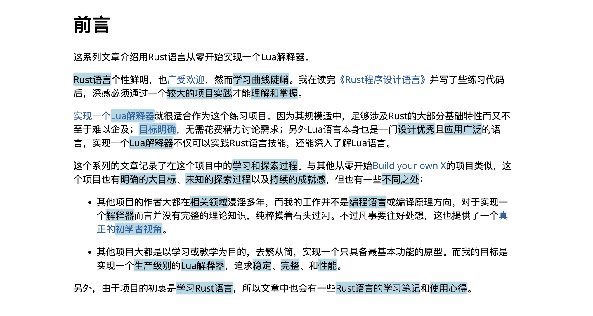

# IntelliRead - AI-Enhanced Reading Experience

IntelliRead is a Chrome browser extension that leverages AI models to help users extract and highlight key information from web content, enhancing the reading experience.

## Installation

1. Clone or download this repository to your local machine
2. Open Chrome browser and navigate to `chrome://extensions/`
3. Enable "Developer mode" (toggle in the top right corner)
4. Click "Load unpacked"
5. Select the project folder

## How to Use

1. After installing the extension, click on the IntelliRead icon in the browser toolbar
2. Before first use, click the "Settings" button to configure your API information:
   - API request URL (default is OpenAI API)
   - API key
   - Model name (e.g., gpt-4o-mini)
   - Highlight color (default is blue)
3. Open any content webpage and trigger analysis through one of these methods:
   - Click on the IntelliRead icon in the browser toolbar, then click "Analyze the current page"
   - Right-click on the page and select "Use IntelliRead to analyze page"
   - Use the keyboard shortcut Ctrl+Shift+I (can be modified in Chrome extension shortcut settings)
4. Once analysis is complete, key content will be highlighted

## Tech Stack

- JavaScript (ES6+)
- Chrome Extensions API
- External AI API (such as OpenAI API)

## Notes

- The extension requires an API key to work, please ensure you configure a valid API key
- Analysis time depends on the length of page content and API response speed
- API calls may incur charges, please refer to the pricing policy of your AI service provider

## Privacy Statement

IntelliRead collects the text content of the webpage you are browsing to send to the AI service for analysis. Your API credentials are stored locally in your browser and are not transmitted anywhere except to the API service you have configured.

## Contributions

Issues and suggestions for improvements are welcome!

## License

MIT
